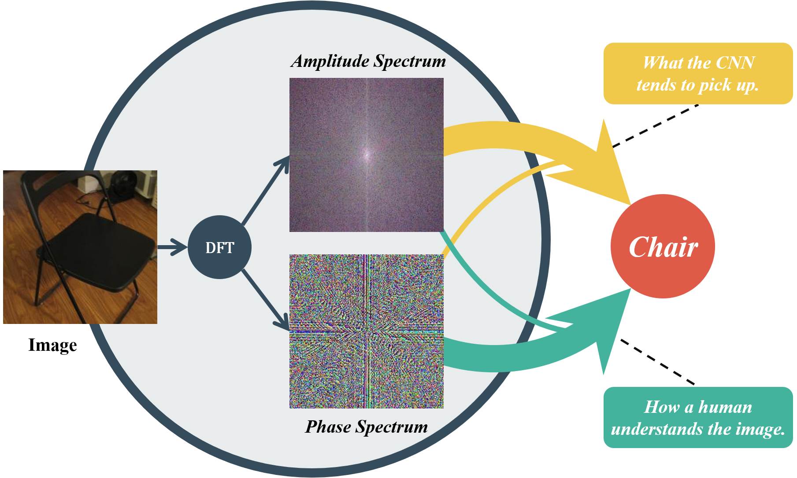
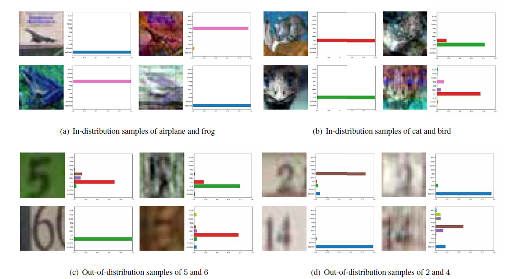

# Amplitude-Phase Recombination (ICCV'21)
Official PyTorch implementation of "**Amplitude-Phase Recombination: Rethinking Robustness of Convolutional Neural Networks in Frequency Domain**",
[Guangyao Chen](https://scholar.google.com/citations?hl=zh-CN&user=zvHHe1UAAAAJ), [Peixi Peng](https://scholar.google.com/citations?hl=zh-CN&user=CFMuFGoAAAAJ), Li Ma, [Jia Li](https://scholar.google.com/citations?hl=zh-CN&user=BfWMlE4AAAAJ), Lin Du, and [Yonghong Tian](https://scholar.google.com/citations?hl=zh-CN&user=fn6hJx0AAAAJ).

**Paper**: https://arxiv.org/abs/2108.08487

> **Abstract:** *Recently, the generalization behavior of Convolutional Neural Networks (CNN) is gradually transparent through explanation techniques with the frequency components decomposition. However, the importance of the phase spectrum of the image for a robust vision system is still ignored. In this paper, we notice that the CNN tends to converge at the local optimum which is closely related to the high-frequency components of the training images, while the amplitude spectrum is easily disturbed such as noises or common corruptions. In contrast, more empirical studies found that humans rely on more phase components to achieve robust recognition. This observation leads to more explanations of the CNN's generalization behaviors in both adversarial attack and out-of-distribution detection, and motivates a new perspective on data augmentation designed by re-combing the phase spectrum of the current image and the amplitude spectrum of the distracter image. That is, the generated samples force the CNN to pay more attention  on the structured information from phase components and keep robust to the variation of the amplitude. Experiments on several image datasets indicate that the proposed method achieves state-of-the-art performances on multiple generalizations and calibration tasks, including adaptability for common corruptions and surface variations, out-of-distribution detection and adversarial attack.*
> 

## Highlights

|Fig. 1: More empirical studies found that humans rely on more phase components to achieve robust recognition. However, CNN without effective training restrictions tends to converge at the local optimum related to the amplitude spectrum of the image, leading to generalization behaviors counter-intuitive to humans (the sensitive to various corruptions and the overconfidence of OOD).|  
 |:--|---|



 **Fig. 2: Four pairs of testing sampless selected from in-distribution CIFAR-10 and OOD SVHN that help explain that CNN capture more amplitude specturm than phase specturm for classification: First, in (a) and (b), the model correctly predicts the original image (1st column in each panel), but the predicts are also exchanged after switching amplitude specturm (3rd column in each panel) while the human eye can still give the correct category through the contour information. Secondly, the model is overconfidence for the OOD samples in (c) and (d). Similarly, after the exchange of amplitude specturm, the label with high confidence is also exchanged.**

<p align="center">
    
</p>

 **Fig. 3: Two ways of the proposed Amplitude-Phase Recombination: APR-P and APR-S. Motivated by the powerful generalizability of the human, we argue that reducing the dependence on the amplitude spectrum and enhancing the ability to capture phase spectrum can improve the robustness of CNN.**

## Citation
If you find our work, this repository and pretrained adversarial generators useful. Please consider giving a star :star: and citation.
```bibtex
@InProceedings{Chen_2021_ICCV,
    author    = {Chen, Guangyao and Peng, Peixi and Ma, Li and Li, Jia and Du, Lin and Tian, Yonghong},
    title     = {Amplitude-Phase Recombination: Rethinking Robustness of Convolutional Neural Networks in Frequency Domain},
    booktitle = {Proceedings of the IEEE/CVF International Conference on Computer Vision (ICCV)},
    month     = {October},
    year      = {2021},
    pages     = {458-467}
}
```

## 1. Requirements
### Environments
Currently, requires following packages
- python 3.6+
- torch 1.7.1+
- torchvision 0.5+
- CUDA 10.1+
- scikit-learn 0.22+

### Datasets
For even quicker experimentation, there is [CIFAR-10-C](https://zenodo.org/record/2535967) and [CIFAR-100-C](https://zenodo.org/record/3555552). 
please download these datasets to ```./data/CIFAR-10-C``` and ```./data/CIFAR-100-C```.

## 2. Training & Evaluation
To train the models on CIFAR, run this command:
```train
python main.py --aug <augmentations>
```
> Option --aug can be one of None/APR-S. The default training method is APR-P. To evaluate the model, add --eval after this command.

**```APRecombination``` for APR-S and ```mix_data``` for APR-P can plug and play in other training codes.**
**We provide an example of training on ImageNet in ```imagenet.py```.**

## 3. Results
### Fourier Analysis
<p align="center">
    
</p>

> The standard trained model is highly sensitive to additive noise in all but the lowest frequencies. APR-SP could substantially improve robustness to most frequency perturbations. The code of Heat maps is developed upon the following project [FourierHeatmap](https://github.com/gatheluck/FourierHeatmap).

### ImageNet-C
- Results of ResNet-50 models on ImageNet-C:

|         | +(APR-P) | +(APR-S)   | +(APR-SP)   | +DeepAugMent+(ARP-SP) |
| :-------- |:---------:| :----:| :----:| :---: |
| mCE   | 70.5     | 69.3 | 65.0 | 57.5 |
